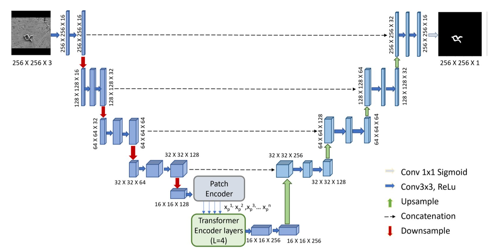
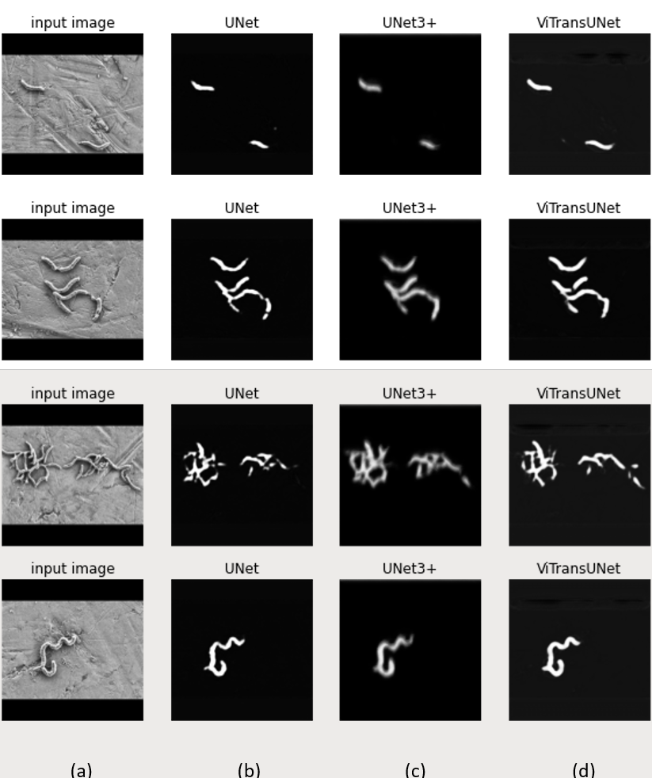

# VTransUNet

A hybrid type of U-Net (called ViTransUNet) which uses Convolutional Neural Networks (CNN)-Vision-Transformer-based contraction layers to integrate the detailed high-resolution spatial data obtained from deep convolution networks with the global context captured by Transformers. The encoded feature representation is upsampled and concatenated with the corresponding encoded layer to learn back image structures lost during pooling in the contraction layer. Our bacterial cell segmentation approach demonstrated a dice similarity score of 84.62% which performed better than U-Net and UNet3+ architectures with significant performance improvement, given the limited dataset available for the experiment.

## Model Architecture

ViTransUNet architecture (example for 256 x 256 pixels image and annotated mask). Each blue box corresponds to a multi-channel feature map. The x-y-z size denoted at the edge of each blue box denotes the x-y size of the feature map and z number of channels. The arrows denote the different operations. The left contracting path of Unet resizes the map to 16x16 feature map which is fed to Patch encoder to generate N vectorized patches xp1, xp2 ,xp3,… xpn. The encoded image representation outputted by the transformer is then resized to initial 16x16 feature map and feeds the right expansive path of the U-net.

## Results

